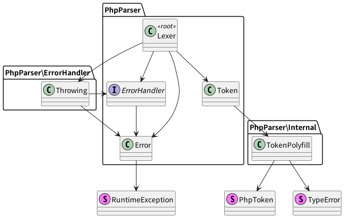

# Dependency Visualizer
[](https://github.com/hirokinoue/dependency-visualizer/actions/workflows/phpunit.yml)

## Overview
Dependency Visualizer is a tool that visualizes dependency among classes.

This tool is experimental and possesses only basic functionality. For example, it doesn't have mechanism to resolve expressions and infer types, nor does it interpret PHPDoc.

# Installation
1. Edit composer.json  
    ```
    {
      "repositories": [
        {
          "type": "vcs",
          "url": "https://github.com/hirokinoue/dependency-visualizer"
        }
      ]
    }
    ```

2. Install using composer  
`$ composer require --dev hirokinoue/dependency-visualizer`

# Configuration
Add a `config.php`, `config.php.dist` or `config.dist.php` to the directory from which you run dependency-visualizer.

`config.php` looks like this:
```
<?php declare(strict_types=1);
return $config = [
    'memoryLimit' => '1024M',
    // Specify a part of a namespace to exclude classes from the analysis.
    // For example, when dependencies of third-party packages are not wanted to be analyzed.
    // Classes starting with the given namespace will not be analyzed and classes they depend on will not.
    // Note that if A depends on B and C, and B depends on C, and B is excluded,
    // the dependence from A to C will be shown, but the dependence from B to C will not be shown.
    'endOfAnalysis' => [
        'Foo\\',
    ],
    // Specify a part of a namespace.
    // Classes starting with the given namespace will not be analyzed.
    'excludeFromAnalysis' => [
        'Foo\Bar\\',
    ],
];
```

# Usage
```
$ ./vendor/bin/dependency-visualizer -h

Usage: dependency-visualizer [options] <target php file>
Options:
  -h: Show this help.
  -l: Output log to current directory.
  -m: Draw methods in diagram.
  -s: Output analysis results in string format.
```

# Example


Items that cannot be distinguished as concrete class, abstract class, interface, trait or enum are drawn as stereotype.
